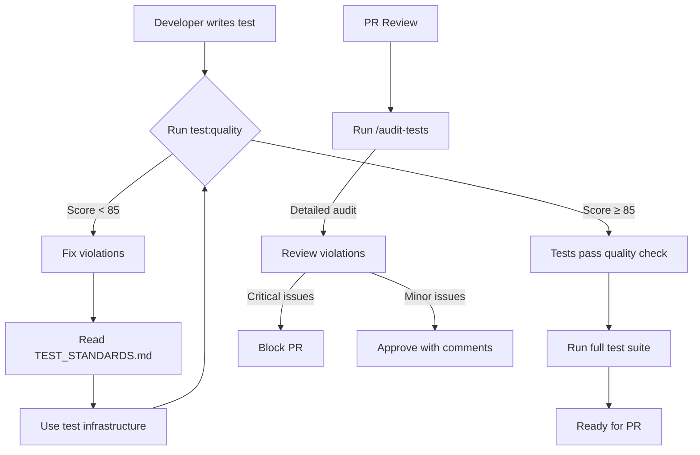

# Test Audit Command Integration

**Date**: 2025-01-26
**Purpose**: Enforce test quality standards through automated auditing

## Audit Command Updates

### Location
`~/.claude/commands/audit-tests.md`

### Key Enhancements

1. **Quality Score Calculation** (NEW)
   - Base score: 100 points
   - Deductions for violations
   - Target score: ≥85/100 to PASS
   - Detailed scoring breakdown

2. **Infrastructure Checks** (NEW)
   - Verifies existence of test factories
   - Checks for test doubles usage
   - Validates constants file
   - Confirms TEST_STANDARDS.md exists

3. **New Violation Categories**
   - Not using test factories (-2 points each)
   - Not using test doubles (-2 points each)
   - Console spying (-3 points each)
   - Magic numbers (-1 point each)
   - Insufficient assertions (-1 point each)
   - Missing error tests (-5 per component)

4. **Enforcement of TEST_STANDARDS.md**
   - Direct reference to standards document
   - Quality target of 85/100 mandatory
   - Specific infrastructure requirements
   - Behavioral testing verification

## Validation Script

### Location
`/workspace/delegate/scripts/validate-test-quality.sh`

### Features
- Quick command-line validation
- Color-coded output
- Immediate pass/fail status
- Specific violation counts
- Actionable next steps

### Usage
```bash
# Run validation
npm run test:quality

# Output shows:
# - Infrastructure check
# - Banned pattern detection
# - Magic number search
# - Assertion density calculation
# - Error test coverage
# - Final quality score
```

## Integration Points

### 1. Package.json Scripts
```json
"test:quality": "./scripts/validate-test-quality.sh",
"test:audit": "echo 'Run /audit-tests command in Claude for full audit'"
```

### 2. Audit Command (/audit-tests)
- Full comprehensive analysis
- Detailed violation examples
- Line-by-line code review
- Suggested fixes
- Architecture recommendations

### 3. Quick Validation (npm run test:quality)
- Fast pattern checking
- Immediate score calculation
- CI/CD integration ready
- Exit code for automation

## Quality Enforcement Workflow



## Scoring System

### Quality Score Calculation

| Violation Type | Penalty | Severity |
|---------------|---------|----------|
| Fake/Empty Test | -5 points | CRITICAL |
| Tautological Test | -5 points | CRITICAL |
| Implementation Testing | -3 points | CRITICAL |
| Console Spying | -3 points | CRITICAL |
| Not Using Factories | -2 points | HIGH |
| Not Using Test Doubles | -2 points | HIGH |
| Magic Numbers | -1 point | MEDIUM |
| Insufficient Assertions | -1 point | MEDIUM |
| Missing Error Tests | -5 points | CRITICAL |
| Excessive Mocking | -10 points | HIGH |

### Score Interpretation

| Score Range | Status | Action Required |
|------------|--------|-----------------|
| 85-100 | ✅ PASS | Good to go |
| 70-84 | ⚠️ WARNING | Improvements needed |
| 50-69 | ❌ FAIL | Major refactoring required |
| 0-49 | ❌ CRITICAL | Complete rewrite needed |

## Command Comparison

### /audit-tests (Full Audit)
- **Time**: 30-60 seconds
- **Detail**: Very comprehensive
- **Output**: Markdown report
- **Use Case**: PR reviews, major refactoring
- **Provides**: Line-by-line analysis, examples, fixes

### npm run test:quality (Quick Check)
- **Time**: 1-2 seconds
- **Detail**: Pattern-based checks
- **Output**: Console with colors
- **Use Case**: Pre-commit, CI checks
- **Provides**: Score, violation counts, next steps

## CI/CD Integration

### GitHub Actions Example
```yaml
- name: Check Test Quality
  run: |
    npm run test:quality
    if [ $? -ne 0 ]; then
      echo "❌ Tests do not meet quality standards (need ≥85/100)"
      exit 1
    fi
```

### Pre-commit Hook
```bash
#!/bin/sh
# .git/hooks/pre-commit

echo "Checking test quality..."
npm run test:quality

if [ $? -ne 0 ]; then
    echo "❌ Commit blocked: Tests must score ≥85/100"
    echo "Run 'npm run test:quality' for details"
    exit 1
fi
```

## Audit Command Examples

### Running the Audit
```
/audit-tests
```

### Expected Output Structure
```markdown
## Test Audit Results - [PASS/FAIL]

**Quality Score: XX/100**
**Target Score: 85/100**
**Infrastructure Compliance: XX%**

### Critical Violations
[Detailed list with code examples]

### Required Actions
[Prioritized fix list]

### Quality Metrics
- Assertion Density: X.X per test
- Mock Usage: XX%
- Infrastructure Usage: XX%
- Error Test Coverage: XX%
```

## Benefits of Integration

1. **Immediate Feedback**: Quick validation shows issues instantly
2. **Detailed Analysis**: Full audit provides comprehensive review
3. **Consistent Standards**: Both tools enforce TEST_STANDARDS.md
4. **Progressive Enhancement**: Start with quick check, escalate to full audit
5. **Automation Ready**: Exit codes enable CI/CD integration
6. **Developer Friendly**: Clear messages and actionable fixes

## Maintaining Quality

### Regular Audits
- Run `/audit-tests` weekly
- Check `test:quality` before every commit
- Review scores in PR descriptions

### Continuous Improvement
- Track quality score over time
- Update TEST_STANDARDS.md as needed
- Add new checks to validation script
- Refine scoring algorithm

### Team Adoption
- Include quality score in PR template
- Add test:quality to CI pipeline
- Review audit reports in code reviews
- Celebrate quality improvements

## Summary

The test audit system now fully enforces our quality standards through:
- ✅ Comprehensive audit command with scoring
- ✅ Quick validation script for rapid feedback
- ✅ Integration with TEST_STANDARDS.md
- ✅ Clear pass/fail criteria (≥85/100)
- ✅ Actionable violation reporting
- ✅ CI/CD ready automation

All tests must now meet our quality standards or they will be flagged by the audit system.